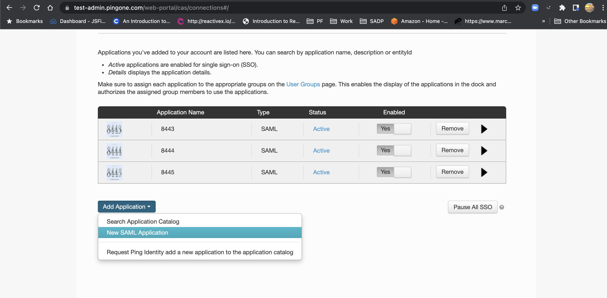
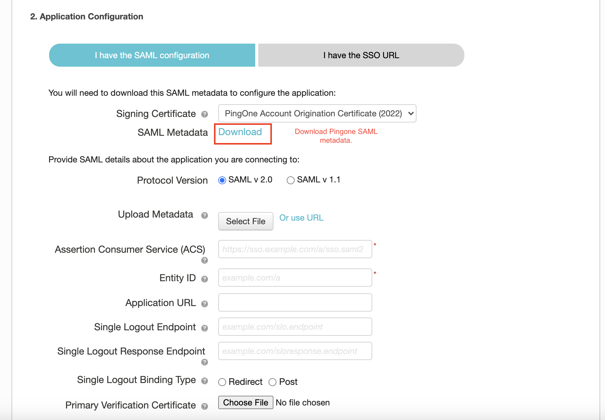
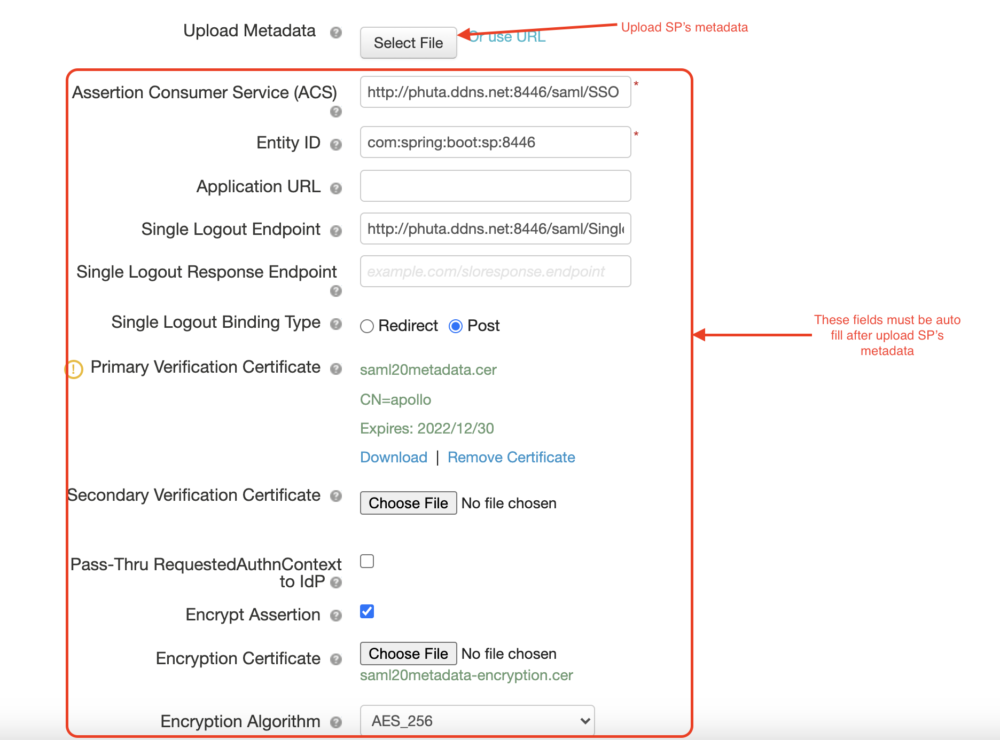

# saml-sso-and-slo-demo-idp-Pingone
This project is to demonstrate the **Spring Boot SAML** 
integration with **an IDP**, so here this spring boot 
app behaves like **SP (Service Provider)** and the **IDP** 
will be the **Pingone**.

### Requirements To Run Applications
* JDK 8 or later
* IDE (Optional)

### Dependencies And Tools Used To Build Applications
* Git
* JDK 11 (tested) or later
* Maven
* Spring Web
* Spring Security
* Spring SAML 2
* Spring Test
* Log4j2
* Thymeleaf
* IDE


### Configuration
##### Login to the **Pingone for Enterprise Web portal** 

##### Goto APPLICATIONS/My Applications menu, click on button "New SAML Application"  

##### In the application configuration page
  1. Download Pingone SAML Metadata 
     
  2. Start the application, for example at port (*required*): **8443**, SP unique ID(*required*), IDP's metadata (*required*): **<full/path/to/pingone/saml/metadata/file>**
     ```
      java -Dserver.port=<portNumber> -Dservice.provider.entity.id=<uniqueID> -Didp.metadata.url=<full/path/to/pingone/saml/metadata/file> -jar spring-boot-security-saml-sample-2.3.1.RELEASE.jar
     ```
  3. Download SP's metadata by access the link http://localhost:8443/saml/metadata
  4. Add the downloaded SP's metadata to Pingone by
     
  5. Continue to finish app setup

## For QAs
* For your convenience, the executable jar file has been uploaded in [binaries](binaries/spring-boot-security-saml-sample-2.3.1.RELEASE.jar) folder
## For developers 
##### Spring Boot Service Provider (SP) Configuration
* Now open the project in the IDE and go to the 
**apllcation.yml** file to do some mandatory configuration, 
here is the location of this file 
`/saml-sso-and-slo-demo-idp-azure-sp-springboot/src/main/resources/application.yml`.


To run this project go to the `/saml-sso-and-slo-demo-idp-azure-sp-springboot/src/main/java/com/spring/boot/security/saml/Application.java` and run the **Application.java** class.

You have already added users in the IDP's application so you can use 
those users to log in to this service.

And we are done here, **Thank You.**
